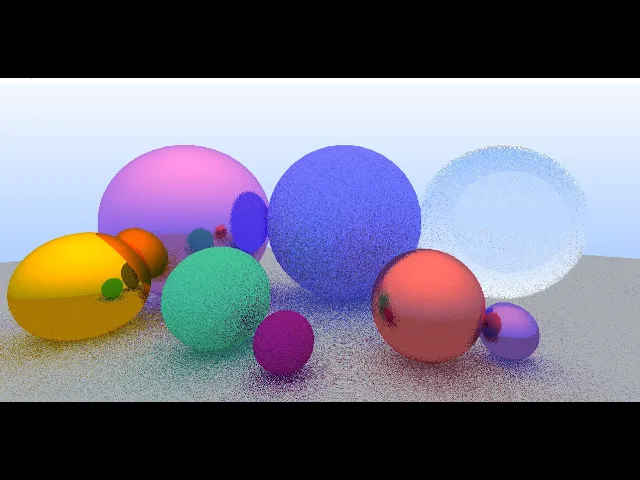

#Compute Path Tracer

Real time GPU path tracer using Direct3D11 Compute shaders. Inspired by the [Ray Tracing in One Weekend](https://raytracing.github.io/books/RayTracingInOneWeekend.html) book.

#Showcase

* For a [Real time demo, click here](https://youtu.be/aW-cF2gUZL0)

#Controls
Use the WASD and Arrow keys to move around the scene.

#Building
This project uses Cmake with no thirdparty libraries. Requirements : Computer with DX11 & Compute Shader support.